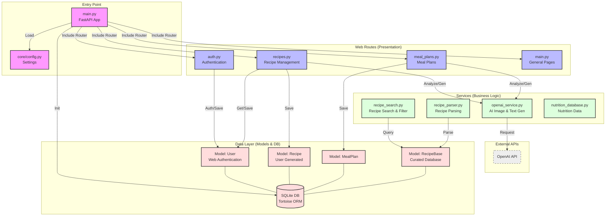

# Архитектура AI Recipe Web App

## Диаграмма зависимостей

## Описание слоев

1.  **Entry Point (`main.py`)**
    *   Точка входа FastAPI приложения. Инициализирует базу данных, подключает маршруты, настраивает middleware.

2.  **Web Routes (`bot/web/routes/`)**
    *   `auth.py`: Аутентификация пользователей (регистрация, вход, JWT токены).
    *   `recipes.py`: Управление рецептами (создание, просмотр, загрузка фото).
    *   `meal_plans.py`: Рационы питания на день.
    *   `main.py`: Общие страницы (главная, профиль, о приложении).

3.  **Services (`bot/services/`)**
    *   `openai_service.py`: Вся логика работы с AI (распознавание фото продуктов, генерация рецептов).
    *   `recipe_search.py`: Логика поиска и фильтрации рецептов по базе данных.
    *   `recipe_parser.py`: Парсинг текстов рецептов.
    *   `nutrition_database.py`: Работа с базой данных продуктов и их nutritional value.

4.  **Models (`bot/core/models.py`)**
    *   `User`: Пользователи с email/password аутентификацией.
    *   `Recipe`: Персональные рецепты, созданные пользователями.
    *   `MealPlan`: Рационы питания на день.
    *   `RecipeBase`: Общая база проверенных рецептов.

